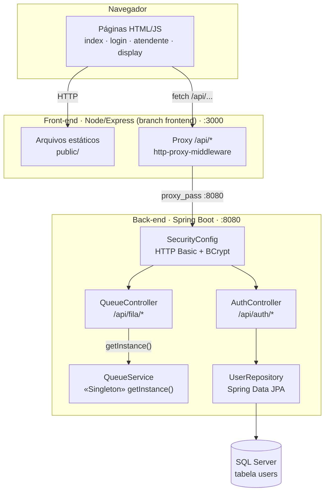
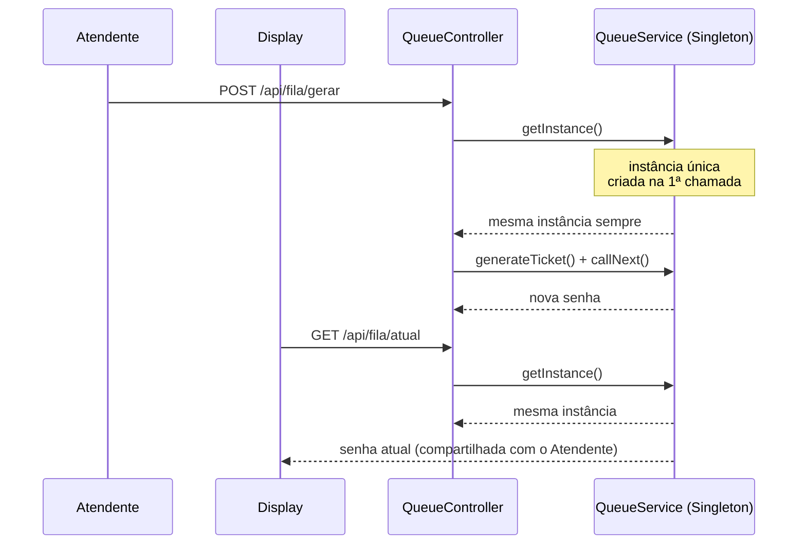

# PainelSenhas

Sistema de painel de senhas (fila de atendimento), reescrito de **C# / ASP.NET** para **Java / Spring Boot**, usado como exercício de Padrões de Projeto de Software — com destaque para o padrão **Singleton** aplicado à fila de senhas (`QueueService`).

O front-end (HTML/CSS/JS + servidor Node/Express) vive na branch [`frontend`](../../tree/frontend) e consome a API deste back-end.

## Arquitetura



## Padrão Singleton em ação

Todas as requisições — de qualquer usuário, a qualquer momento — acessam a **mesma instância** de `QueueService`, garantindo um contador de senhas e um histórico únicos e consistentes.



## Como rodar

### Pré-requisitos
- Java 21+
- Maven
- SQL Server acessível em `localhost` (usado apenas pela autenticação)
- Node.js (para o front-end, branch `frontend`)

### Back-end (Spring Boot)
```bash
mvn spring-boot:run
```
Sobe em `http://localhost:8080`. Configure a conexão em `src/main/resources/application.properties`.

### Front-end (branch `frontend`)
```bash
git checkout frontend
npm install
npm start
```
Sobe em `http://localhost:3000` e faz proxy de `/api/*` para o back-end em `:8080`.

## Endpoints principais

| Método | Rota | Descrição | Autenticação |
|---|---|---|---|
| POST | `/api/auth/register` | Cadastra usuário | Pública |
| POST | `/api/auth/login` | Login (HTTP Basic) | Pública |
| GET | `/api/auth/me` | Dados do usuário logado | Requer login |
| POST | `/api/fila/gerar` | Gera nova senha | Pública |
| GET | `/api/fila/atual` | Senha atual | Pública |
| GET | `/api/fila/historico` | Histórico de senhas chamadas | Pública |
