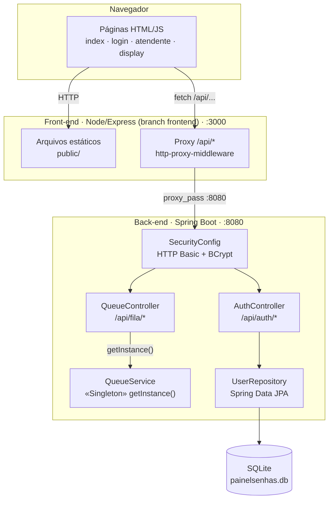
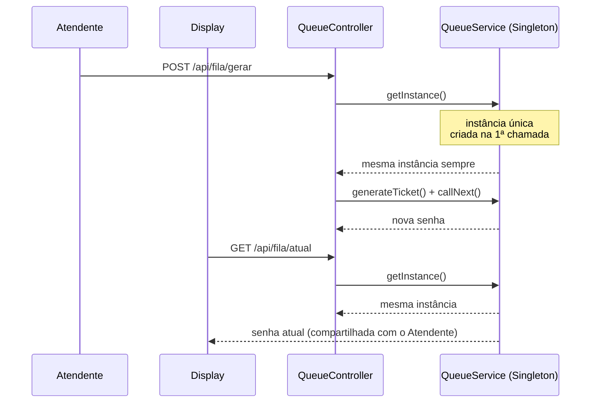
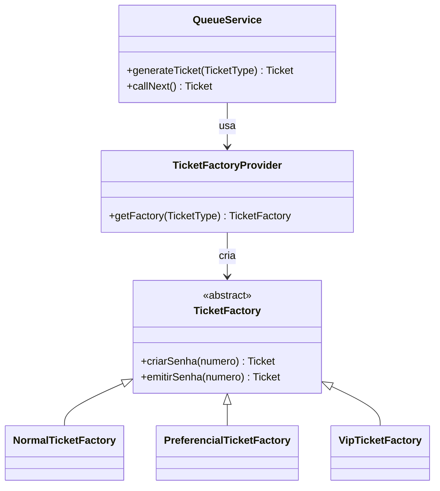

# PainelSenhas

Sistema de painel de senhas (fila de atendimento), reescrito de **C# / ASP.NET** para **Java / Spring Boot**, usado como exercício de Padrões de Projeto de Software — com destaque para o padrão **Singleton** aplicado à fila de senhas (`QueueService`) e o padrão **Factory Method** aplicado à emissão de senhas de tipos diferentes (`TicketFactory`).

O front-end (HTML/CSS/JS + servidor Node/Express) vive na branch [`frontend`](../../tree/frontend) e consome a API deste back-end.

## Arquitetura



## Padrão Singleton em ação

Todas as requisições — de qualquer usuário, a qualquer momento — acessam a **mesma instância** de `QueueService`, garantindo um contador de senhas e um histórico únicos e consistentes.



## Padrão Factory Method em ação

`QueueController` nunca instancia `NormalTicketFactory`, `PreferencialTicketFactory` ou `VipTicketFactory` diretamente — ele pede uma senha do tipo informado, e `TicketFactoryProvider` escolhe a Factory concreta correspondente. Cada Factory decide o prefixo e a prioridade da senha (`Ticket`) que ela cria.



A prioridade atribuída por cada Factory concreta (Normal = 1, Preferencial = 2, VIP = 3) é o que muda o comportamento real do `callNext()`: a fila VIP é sempre esvaziada antes da Preferencial, que é esvaziada antes da Normal.

## Como rodar

### Pré-requisitos
- Java 21+
- Maven
- Nenhum servidor de banco necessário — usa **SQLite** (arquivo local `painelsenhas.db`, criado automaticamente na primeira execução)
- Node.js (opcional — só se quiser rodar o front-end separado pela branch `frontend`; o Spring Boot já serve `public/` sozinho em `:8080`)

### Back-end (Spring Boot)
```bash
mvn spring-boot:run
```
Sobe em `http://localhost:8080`. Configure a conexão em `src/main/resources/application.properties`.

### Front-end (branch `frontend`)
```bash
git checkout frontend
npm install
npm start
```
Sobe em `http://localhost:3000` e faz proxy de `/api/*` para o back-end em `:8080`.

## Endpoints principais

| Método | Rota | Descrição | Autenticação |
|---|---|---|---|
| POST | `/api/auth/register` | Cadastra usuário | Pública |
| POST | `/api/auth/login` | Login (HTTP Basic) | Pública |
| GET | `/api/auth/me` | Dados do usuário logado | Requer login |
| POST | `/api/fila/gerar/{tipo}` | Emite nova senha (`tipo` = `normal`, `preferencial` ou `vip`) | Pública |
| POST | `/api/fila/chamar-proximo` | Chama a próxima senha (prioridade: VIP > Preferencial > Normal) | Pública |
| GET | `/api/fila/atual` | Última senha chamada | Pública |
| GET | `/api/fila/historico` | Histórico de senhas chamadas | Pública |
| GET | `/api/fila/espera` | Quantidade de senhas aguardando, por tipo | Pública |
| GET | `/api/fila/instancia` | Prova do Singleton (id + horário de criação) | Pública |
