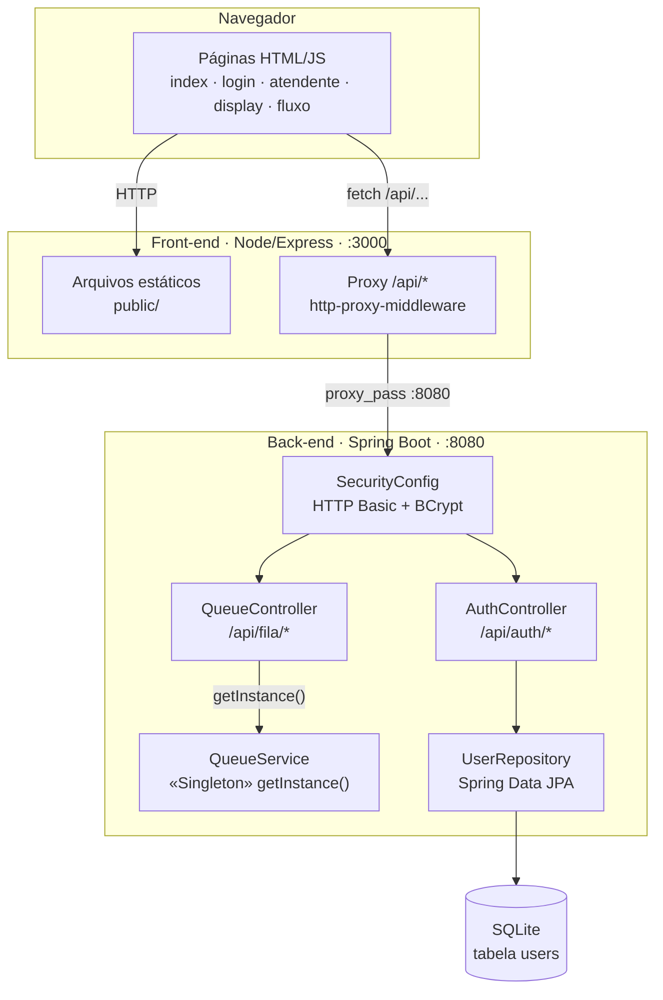
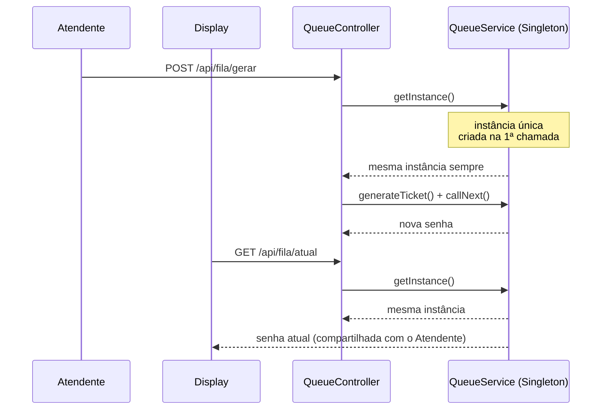

# PainelSenhas — Padrão de Projeto Singleton na Prática

> Material de apoio para apresentação em sala de aula. Este documento reúne todo o
> contexto do projeto, o conceito teórico do padrão Singleton, sua implementação real
> em código Java/Spring Boot, e um roteiro de demonstração ao vivo.

## 1. Contexto do projeto

O **PainelSenhas** é um sistema de fila de atendimento (tipo o painel de senhas de
uma agência bancária ou clínica: "senha 042, guichê 3"). O projeto nasceu como uma
adaptação de um sistema original em **C# / ASP.NET (Blazor Server)** para
**Java / Spring Boot**, usado como estudo de caso de Padrões de Projeto de Software.

O sistema tem duas partes:

- **Back-end**: API REST em Java com Spring Boot, responsável por gerar senhas,
  manter o histórico de chamadas e autenticar usuários.
- **Front-end**: páginas HTML/CSS/JS servidas por um pequeno servidor Node.js
  (Express), que consomem a API do back-end.

O ponto central do projeto, e o motivo de existir, é demonstrar o padrão
**Singleton** de forma que dê para ver, ao vivo, em vez de só ler no código.

## 2. Arquitetura geral



**Como as camadas se conectam:**

- O navegador só fala com o front-end (`:3000`). O Express serve as páginas estáticas
  e faz *proxy* de todo caminho `/api/*` para o back-end Spring Boot (`:8080`) — isso
  evita problemas de CORS, já que do ponto de vista do navegador tudo é a mesma origem.
- `/api/fila/**` é público (não exige login) — equivalente às páginas `Atendente.razor`
  e `Display.razor` do projeto C# original, que também eram abertas.
- `/api/auth/**` (exceto registro e login) exige autenticação HTTP Basic — equivalente
  ao ASP.NET Identity.
- Autenticação usa **SQLite** (arquivo local, sem servidor de banco necessário) via
  Spring Data JPA/Hibernate.

## 3. O padrão Singleton

### 3.1 O que é

**Singleton** é um padrão de projeto **criacional**. Ele garante que uma classe tenha
**uma única instância** durante toda a execução da aplicação, e fornece **um ponto de
acesso global** a ela.

Três características clássicas:

1. **Construtor privado** — nada fora da própria classe pode fazer `new Classe()`.
2. **Atributo estático** que guarda a única instância já criada.
3. **Método estático** (`getInstance()`) que cria a instância na primeira chamada e
   retorna sempre a mesma depois disso.

### 3.2 Por que usar aqui

Numa aplicação web, cada requisição HTTP normalmente é tratada de forma independente.
Se o `QueueService` não fosse Singleton, cada chamada de API poderia, em tese, acabar
manipulando uma cópia diferente do contador de senhas — o sistema perderia a
consistência: o Atendente veria um número, o Display outro. O Singleton garante que
existe **uma única fonte de verdade** para o estado da fila, compartilhada por todos
os clientes que acessam o sistema.

### 3.3 Analogia para explicar em sala

> "Pensem numa copiadora de senhas de banco. Não faz sentido cada guichê ter a sua
> própria máquina de senhas — senão o guichê 1 chamaria a senha 5 e o guichê 2
> também chamaria a senha 5, ao mesmo tempo, cada um com sua contagem própria. Tem que
> existir **uma única máquina**, compartilhada por todos os guichês e por todos os
> painéis de display."

### 3.4 Implementação real (`QueueService.java`)

```java
package com.painelsenhas.service;

import java.time.LocalTime;
import java.time.format.DateTimeFormatter;
import java.util.ArrayList;
import java.util.List;

public class QueueService {

    // 1. Atributo estático privado: guarda a única instância da classe.
    //    Pertence à CLASSE, não a um objeto — existe uma única cópia dele
    //    durante toda a vida da aplicação.
    private static QueueService uniqueInstance;

    // Atributos de negócio
    private int currentTicket;
    private List<Integer> calledTickets;

    // Identidade da instância — existe só para tornar o Singleton visível na demo:
    // toda requisição, de qualquer cliente, deve enxergar o mesmo instanceId.
    private final String instanceId;
    private final String createdAt;

    // 2. Construtor PRIVADO: ninguém fora desta classe pode dar "new QueueService()"
    private QueueService() {
        this.currentTicket = 0;
        this.calledTickets = new ArrayList<>();
        this.instanceId = Integer.toHexString(System.identityHashCode(this));
        this.createdAt = LocalTime.now().format(DateTimeFormatter.ofPattern("HH:mm:ss"));
    }

    // 3. Método estático público: o único ponto de acesso global à instância.
    //    synchronized garante thread-safety em ambiente web — sem isso, duas
    //    threads poderiam cair no "if" ao mesmo tempo e criar DUAS instâncias
    //    por acidente (condição de corrida).
    public static synchronized QueueService getInstance() {
        if (uniqueInstance == null) {
            uniqueInstance = new QueueService();
        }
        return uniqueInstance;
    }

    public int generateTicket() {
        this.currentTicket = this.currentTicket + 1;
        return this.currentTicket;
    }

    public int getLastTicket() {
        return this.currentTicket;
    }

    public void callNext(int ticket) {
        this.calledTickets.add(ticket);
    }

    public List<Integer> getHistory() {
        return this.calledTickets;
    }

    public String getInstanceId() {
        return this.instanceId;
    }

    public String getCreatedAt() {
        return this.createdAt;
    }
}
```

**Leitura linha a linha, para explicar em sala:**

| Elemento | O que faz | Por que importa |
|---|---|---|
| `private static QueueService uniqueInstance` | Guarda a única instância | Existe uma única cópia dessa variável em toda a aplicação |
| `private QueueService()` | Construtor privado | Impede `new QueueService()` de qualquer outro lugar do código |
| `getInstance()` | Cria na 1ª chamada, reaproveita depois | Garante que todos recebem a **mesma referência de objeto** |
| `synchronized` | Trava a criação para uma thread por vez | Evita duas instâncias acidentais sob concorrência (ausente no C# original) |
| `instanceId` / `createdAt` | Hash de identidade + horário de criação | Usado só para **provar visualmente** o Singleton na demo (ver seção 5) |

### 3.5 Onde ele é usado (`QueueController.java`)

```java
@RestController
@RequestMapping("/api/fila")
@CrossOrigin(origins = "*")
public class QueueController {

    @PostMapping("/gerar")
    public ResponseEntity<Integer> gerarNovaSenha() {
        int novaSenha = QueueService.getInstance().generateTicket();
        QueueService.getInstance().callNext(novaSenha);
        return ResponseEntity.ok(novaSenha);
    }

    @GetMapping("/atual")
    public ResponseEntity<Integer> getSenhaAtual() {
        int atual = QueueService.getInstance().getLastTicket();
        return ResponseEntity.ok(atual);
    }

    @GetMapping("/historico")
    public ResponseEntity<List<Integer>> getHistorico() {
        return ResponseEntity.ok(QueueService.getInstance().getHistory());
    }

    @GetMapping("/instancia")
    public ResponseEntity<InstanceInfo> getInstancia() {
        QueueService instance = QueueService.getInstance();
        return ResponseEntity.ok(new InstanceInfo(instance.getInstanceId(), instance.getCreatedAt()));
    }

    public record InstanceInfo(String instanceId, String createdAt) {}
}
```

Todo método do controller chama `QueueService.getInstance()` antes de fazer qualquer
coisa. Não importa se a chamada veio do Atendente clicando "Emitir Nova Senha" ou do
Display fazendo *polling* a cada 2 segundos — ambos recebem a **mesma referência de
objeto**, por isso o contador (`currentTicket`) e o histórico (`calledTickets`) ficam
sincronizados entre todas as telas.

## 4. Sequência de uma requisição



## 5. Demonstração ao vivo

O front-end tem três telas construídas especificamente para tornar o Singleton
**visível**, não só teórico:

### 5.1 Selo de instância (`/atendente` e `/display`)

Cada uma dessas páginas exibe, junto ao número da senha, um selo:

```
🔒 Instância do servidor: #a3f21c (criada às 13:29:07)
```

Esse valor vem do endpoint `GET /api/fila/instancia`, que devolve o
`instanceId` (hash de identidade do objeto Java) e o horário em que o
`QueueService` foi criado. **Se você abrir 5 abas diferentes de `/display`, todas
vão mostrar exatamente o mesmo `#instanceId`** — prova visual inequívoca de que é o
mesmo objeto na memória do servidor, não importa quantos clientes o consultem.

### 5.2 Página `/fluxo` — animação do caminho da requisição

Uma página dedicada renderiza o diagrama de arquitetura (via Mermaid.js) e anima uma
bolinha percorrendo o caminho real de uma requisição: **Atendente → QueueController
→ QueueService (Singleton) → Display A / Display B**. O clique no botão dispara uma
chamada de verdade à API (não é uma simulação fake) e, junto com a animação, aparece
um log passo a passo explicando o que está acontecendo tecnicamente em cada etapa —
até a senha gerada de fato ser exibida no final.

### 5.3 Roteiro sugerido para a aula (2–3 minutos)

1. **Abra a analogia** (a copiadora de senhas — seção 3.3) antes de mostrar qualquer
   código ou tela.
2. **Mostre o código** do `getInstance()` no `QueueService.java`, explicando as três
   garantias: construtor privado, atributo estático, e reaproveitamento da instância.
3. **Abra três janelas lado a lado**: `/atendente`, `/display` e `/display` de novo
   em aba anônima (simulando "outro totem/tela").
4. Aponte o selo `🔒 Instância do servidor` nas três — mesmo `#id` em todas.
5. Clique em "Emitir Nova Senha" no Atendente.
6. Mostre que as duas telas de Display mudam **ao mesmo tempo**, com o mesmo número,
   mesmo sendo requisições HTTP totalmente independentes.
7. **Feche com a página `/fluxo`**, rodando a animação uma vez como resumo visual de
   tudo que acabou de ser demonstrado.

## 6. Referência rápida dos endpoints

| Método | Rota | Descrição | Autenticação |
|---|---|---|---|
| POST | `/api/auth/register` | Cadastra usuário | Pública |
| POST | `/api/auth/login` | Login (HTTP Basic) | Pública |
| GET | `/api/auth/me` | Dados do usuário logado | Requer login |
| POST | `/api/fila/gerar` | Emite nova senha | Pública |
| GET | `/api/fila/atual` | Senha atual | Pública |
| GET | `/api/fila/historico` | Histórico de senhas chamadas | Pública |
| GET | `/api/fila/instancia` | ID e horário de criação da instância do Singleton | Pública |

## 7. Documentação interativa (Swagger)

A API também tem uma página de testes gerada automaticamente pelo Swagger
(springdoc-openapi). Com o back-end rodando, acesse:

```
http://localhost:8080/swagger-ui.html
```

Lá é possível ver todos os endpoints agrupados, ler a descrição de cada um (a mesma
explicação usada neste documento, escrita direto nas anotações do código) e clicar em
**"Try it out"** para chamar a API de verdade sem precisar do front-end nem do
`curl` — ótimo para, durante a aula, mostrar o endpoint `GET /api/fila/instancia`
sendo chamado duas vezes seguidas e o `instanceId` não mudar.

## 8. Como executar

```bash
# Back-end (Spring Boot) — porta 8080
mvn spring-boot:run

# Front-end (Node/Express) — porta 3000
npm install
npm start
```

Depois, acesse `http://localhost:3000` no navegador (ou `http://localhost:8080/swagger-ui.html`
para testar a API diretamente).

## 9. Resumo em uma frase

> O `QueueService` é a única "máquina de senhas" que existe na memória do servidor:
> o construtor privado impede que alguém crie outra, e o `getInstance()` garante que
> toda parte do sistema — Atendente, Display, ou qualquer tela nova que se conecte —
> está sempre lendo e escrevendo no mesmo objeto compartilhado.
