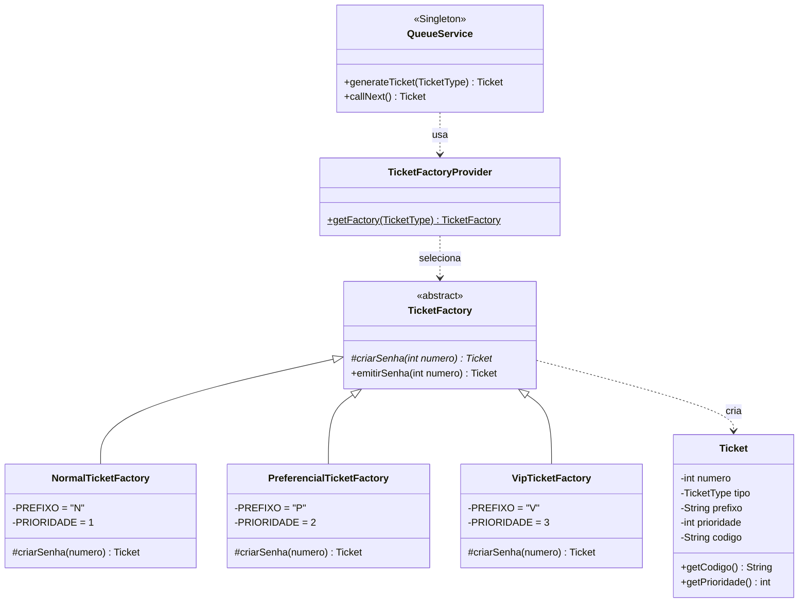
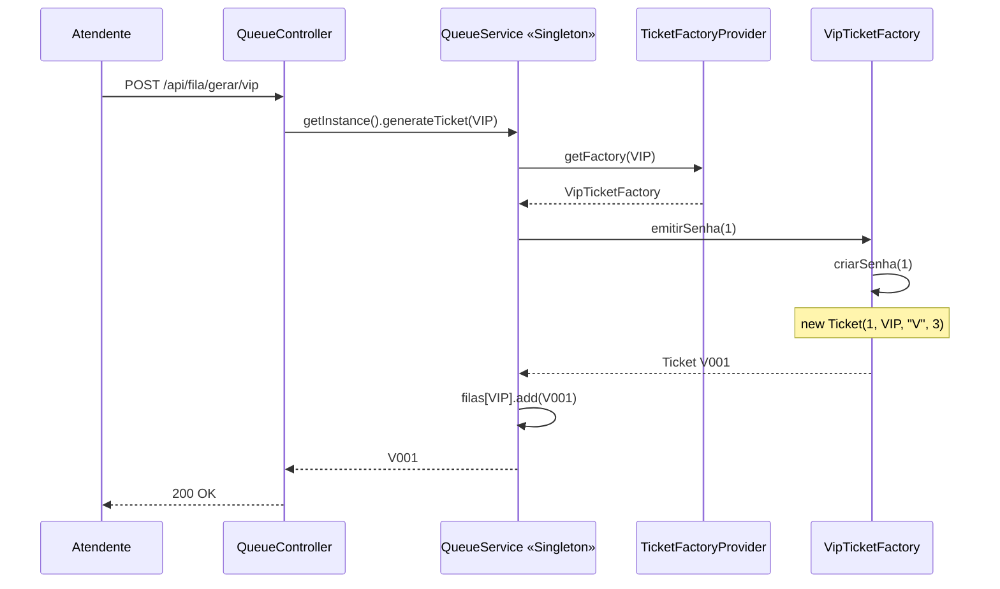

# PainelSenhas — Factory Method na Prática

> Material-fonte para geração de vídeo no NotebookLM.
> Tema: o padrão **Factory Method** aplicado à emissão de senhas de uma fila de
> atendimento, sobre uma base que já usava **Singleton**.
> Duração-alvo do vídeo: 8 a 10 minutos.

---

## 1. O problema que motiva o padrão

O **PainelSenhas** é um sistema de fila de atendimento — o painel de senhas de uma
agência bancária ou de uma clínica: *"senha V007, guichê 3"*. Ele nasceu como
adaptação de um sistema em C# / ASP.NET para Java / Spring Boot, como estudo de
Padrões de Projeto.

Na primeira versão existia **um único tipo de senha**. O serviço da fila tinha um
contador, incrementava, devolvia o número. Simples.

Aí chega o requisito real: a fila precisa de **três tipos de senha** —
**Normal**, **Preferencial** e **VIP**. Cada uma com:

- um **prefixo** próprio no código (`N001`, `P001`, `V001`),
- um **contador independente** (a numeração Normal não interfere na VIP),
- uma **prioridade de atendimento** diferente.

A saída ingênua seria um `if/else` ou um `switch` dentro do serviço da fila:

```java
// O que NÃO foi feito
if (tipo.equals("normal"))          { codigo = "N" + contadorNormal++; prioridade = 1; }
else if (tipo.equals("preferencial")){ codigo = "P" + contadorPref++;  prioridade = 2; }
else if (tipo.equals("vip"))         { codigo = "V" + contadorVip++;   prioridade = 3; }
```

Isso funciona — e apodrece rápido. Cada novo tipo de senha (Idoso, Empresarial,
Agendado) obriga a **abrir e editar** a classe da fila. A regra de "como uma senha
é construída" fica espalhada dentro da regra de "como a fila é atendida". São duas
responsabilidades no mesmo lugar, e a classe cresce a cada requisito novo.

**O Factory Method resolve exatamente isso:** ele tira a decisão de *qual objeto
criar* de dentro de quem usa o objeto, e a empurra para subclasses especializadas.

---

## 2. O padrão em teoria

Factory Method é um padrão **criacional**. A definição clássica (GoF):

> *Define uma interface para criar um objeto, mas deixa as subclasses decidirem
> qual classe instanciar. O Factory Method permite que uma classe delegue a
> instanciação às subclasses.*

Os quatro papéis do padrão, e quem os ocupa neste projeto:

| Papel no padrão | Classe no PainelSenhas | Responsabilidade |
|---|---|---|
| **Product** | `Ticket` | O objeto criado — a senha em si |
| **Creator** (abstrato) | `TicketFactory` | Declara o factory method e o fluxo comum |
| **ConcreteCreator** | `NormalTicketFactory`, `PreferencialTicketFactory`, `VipTicketFactory` | Cada uma decide **qual** `Ticket` construir |
| **Cliente** | `QueueService` | Pede uma senha sem saber qual Factory a atendeu |

E um papel extra, que não é do GoF mas é prático:

| **Provider / Registry** | `TicketFactoryProvider` | Único ponto que mapeia `TicketType` → Factory concreta |

---

## 3. A estrutura no código



O ponto visual mais importante desse diagrama: **não existe seta de `QueueService`
para `NormalTicketFactory`, `PreferencialTicketFactory` ou `VipTicketFactory`.**
O cliente do padrão nunca menciona nenhuma classe concreta. Ele só conhece a
abstração `TicketFactory` e o enum `TicketType`.

---

## 4. O código, peça por peça

### 4.1 Product — `Ticket`

A senha carrega tudo que a Factory decidiu por ela: prefixo, prioridade e o código
já formatado.

```java
public class Ticket {
    private final int numero;
    private final TicketType tipo;
    private final String prefixo;
    private final int prioridade;
    private final String codigo;
    private final String horaGeracao;

    public Ticket(int numero, TicketType tipo, String prefixo, int prioridade) {
        this.numero = numero;
        this.tipo = tipo;
        this.prefixo = prefixo;
        this.prioridade = prioridade;
        this.codigo = prefixo + String.format("%03d", numero);  // N001, P001, V001
        this.horaGeracao = LocalTime.now().format(DateTimeFormatter.ofPattern("HH:mm:ss"));
    }
}
```

Repare: `Ticket` é **imutável** (todos os campos `final`) e **burro de propósito** —
ele não decide nada, apenas guarda. Toda a inteligência da criação está na Factory.

### 4.2 Creator abstrato — `TicketFactory`

Esta é a peça central do padrão:

```java
public abstract class TicketFactory {

    // O FACTORY METHOD: cada subclasse decide QUAL Ticket instanciar
    protected abstract Ticket criarSenha(int numero);

    // Método "template" que usa o factory method acima
    public final Ticket emitirSenha(int numero) {
        Ticket senha = criarSenha(numero);
        // ponto de extensão comum a qualquer tipo de senha
        // (ex.: log, auditoria, notificação futura)
        return senha;
    }
}
```

Dois detalhes que valem parar no vídeo:

- `criarSenha` é `protected abstract` — é o **factory method** propriamente dito.
  É `protected` porque ninguém de fora chama; é um ponto de extensão interno.
- `emitirSenha` é **`final`** — de propósito. Ele fixa o *fluxo* comum de emissão
  (hoje trivial, amanhã com log, auditoria, métricas) e permite variar só a
  *criação*. É o casamento clássico entre Factory Method e Template Method.

### 4.3 ConcreteCreators — as três Factories

Cada uma é curta, e é esse o ponto. Toda a variação entre tipos de senha cabe em
duas constantes e uma linha:

```java
public class VipTicketFactory extends TicketFactory {
    private static final String PREFIXO = "V";
    private static final int PRIORIDADE = 3;   // a mais alta

    @Override
    protected Ticket criarSenha(int numero) {
        return new Ticket(numero, TicketType.VIP, PREFIXO, PRIORIDADE);
    }
}
```

`NormalTicketFactory` é idêntica com `"N"` e `1`; `PreferencialTicketFactory`
com `"P"` e `2`.

### 4.4 O Provider — isolando o `switch`

O `switch` não desapareceu do sistema. Ele foi **confinado em um único lugar**:

```java
public final class TicketFactoryProvider {
    private TicketFactoryProvider() {}

    public static TicketFactory getFactory(TicketType tipo) {
        return switch (tipo) {
            case NORMAL       -> new NormalTicketFactory();
            case PREFERENCIAL -> new PreferencialTicketFactory();
            case VIP          -> new VipTicketFactory();
        };
    }
}
```

Essa é a resposta honesta a quem pergunta *"mas não é só um switch disfarçado?"*:
a diferença é que agora existe **exatamente um** switch no sistema inteiro, num
arquivo de 15 linhas cuja única razão de existir é esse mapeamento. O switch
espalhado é que era o problema, não o switch em si.

Como é um `switch` sobre enum com seta (`->`), o compilador Java exige
exaustividade: adicionar um valor novo em `TicketType` sem tratá-lo aqui
**quebra a compilação** — o erro aparece antes de virar bug em produção.

### 4.5 Cliente — `QueueService` (que também é o Singleton)

```java
public synchronized Ticket generateTicket(TicketType tipo) {
    int numero = contadores.merge(tipo, 1, Integer::sum);   // contador por tipo
    TicketFactory factory = TicketFactoryProvider.getFactory(tipo);
    Ticket senha = factory.emitirSenha(numero);
    filas.get(tipo).add(senha);
    return senha;
}
```

Três linhas de verdade. O serviço da fila **não sabe** o que é "VIP". Ele pede a
Factory correspondente ao tipo, manda emitir, enfileira. Se amanhã surgir um tipo
"Idoso", este método não muda uma vírgula.

---

## 5. Onde o padrão vira comportamento visível

O Factory Method aqui não é decoração: a **prioridade** que cada Factory concreta
grava no `Ticket` é o que muda a ordem real de atendimento.

```java
private static final List<TicketType> ORDEM_PRIORIDADE =
        List.of(TicketType.VIP, TicketType.PREFERENCIAL, TicketType.NORMAL);

public synchronized Ticket callNext() {
    for (TicketType tipo : ORDEM_PRIORIDADE) {
        Queue<Ticket> fila = filas.get(tipo);
        if (!fila.isEmpty()) {
            Ticket chamada = fila.poll();   // FIFO dentro do mesmo tipo
            historico.add(chamada);
            ultimaChamada = chamada;
            return chamada;
        }
    }
    return null;
}
```

A regra resultante: **a fila VIP é esvaziada antes da Preferencial, que é
esvaziada antes da Normal.** Dentro de um mesmo tipo, vale ordem de chegada.

### Cenário de demonstração



Sequência a executar ao vivo (ou a narrar):

1. Gerar **3 senhas Normais** → `N001`, `N002`, `N003`
2. Gerar **1 Preferencial** → `P001`
3. Gerar **1 VIP** → `V001`
4. Chamar próximo **5 vezes**

Ordem de chamada resultante: **`V001` → `P001` → `N001` → `N002` → `N003`**

Mesmo tendo chegado por último, a VIP é a primeira. E nada disso está codificado
em `if`s: está codificado no **número 3** que a `VipTicketFactory` gravou no
`Ticket` no momento da criação.

---

## 6. Como o Factory Method convive com o Singleton

O projeto demonstra os dois padrões ao mesmo tempo, e eles não competem — resolvem
perguntas diferentes:

| | Singleton | Factory Method |
|---|---|---|
| **Pergunta que responde** | *Quantas instâncias existem?* | *Qual classe instanciar?* |
| **Aplicado a** | `QueueService` | `Ticket` |
| **Efeito no sistema** | Uma fila única compartilhada por todos os usuários | Três tipos de senha sem `if` no cliente |

```java
// Singleton garante que a fila é uma só
public static synchronized QueueService getInstance() {
    if (uniqueInstance == null) {
        uniqueInstance = new QueueService();
    }
    return uniqueInstance;
}
```

Todo `QueueController` chama `QueueService.getInstance()` — nunca `new`. Por isso
o atendente e o display enxergam exatamente a mesma fila. O endpoint
`GET /api/fila/instancia` devolve o hash de identidade da instância: chamando duas
vezes, de abas diferentes, o `instanceId` é sempre o mesmo. Essa é a prova visual
do Singleton.

---

## 7. Os endpoints

| Método | Rota | O que demonstra |
|---|---|---|
| POST | `/api/fila/gerar/{tipo}` | Factory Method — `tipo` = `normal`, `preferencial` ou `vip` |
| POST | `/api/fila/chamar-proximo` | A prioridade definida pelas Factories em ação |
| GET | `/api/fila/atual` | Última senha chamada |
| GET | `/api/fila/historico` | Ordem real de atendimento |
| GET | `/api/fila/espera` | Quantas senhas aguardam, por tipo |
| GET | `/api/fila/instancia` | Prova do Singleton (id + horário de criação) |

O controller mostra o padrão do lado da borda:

```java
@PostMapping("/gerar/{tipo}")
public ResponseEntity<?> gerarNovaSenha(@PathVariable String tipo) {
    try {
        TicketType tipoSenha = TicketType.valueOf(tipo.trim().toUpperCase());
        Ticket senha = QueueService.getInstance().generateTicket(tipoSenha);
        return ResponseEntity.ok(senha);
    } catch (IllegalArgumentException ex) {
        return ResponseEntity.badRequest()
                .body("Tipo inválido. Use: normal, preferencial ou vip.");
    }
}
```

O controller também não conhece Factory concreta nenhuma. Ele converte a string da
URL em `TicketType` e repassa. A seleção da Factory acontece uma camada abaixo.

---

## 8. O teste decisivo: adicionar um tipo novo

A melhor forma de fechar o vídeo é mostrar o custo de estender. Para criar um tipo
**Idoso**, prioridade 4 (acima de todos):

**Passo 1** — adicionar o valor no enum:
```java
public enum TicketType { NORMAL, PREFERENCIAL, VIP, IDOSO }
```

**Passo 2** — criar a Factory (arquivo novo, 12 linhas):
```java
public class IdosoTicketFactory extends TicketFactory {
    private static final String PREFIXO = "I";
    private static final int PRIORIDADE = 4;

    @Override
    protected Ticket criarSenha(int numero) {
        return new Ticket(numero, TicketType.IDOSO, PREFIXO, PRIORIDADE);
    }
}
```

**Passo 3** — registrar no Provider (uma linha):
```java
case IDOSO -> new IdosoTicketFactory();
```

**Passo 4** — inserir na ordem de prioridade (uma linha):
```java
List.of(TicketType.IDOSO, TicketType.VIP, TicketType.PREFERENCIAL, TicketType.NORMAL)
```

**O que NÃO precisou mudar:** `Ticket`, `TicketFactory`, as três Factories
existentes, `QueueController`, o front-end genérico, nenhum teste das outras
Factories.

Isso é o **Princípio Aberto/Fechado** medido na prática: o sistema ficou aberto
para extensão (um arquivo novo) e fechado para modificação (nenhuma classe
existente teve sua lógica alterada — só houve *registro* do novo tipo).

---

## 9. Perguntas que a turma costuma fazer

**"Isso não é Abstract Factory?"**
Não. Abstract Factory cria **famílias** de produtos relacionados (ex.: uma factory
que cria `Botão` + `Janela` + `Menu` de um mesmo tema). Aqui cada Factory cria
**um único produto**, o `Ticket`. Um produto por factory = Factory Method.

**"Por que não usar `@Component` e injeção do Spring?"**
Daria certo e seria mais idiomático em Spring. A escolha por `new` explícito no
`TicketFactoryProvider` é **didática**: deixa o padrão visível no código em vez de
escondido no container de injeção de dependências. Em produção, registrar as
Factories como beans num `Map<TicketType, TicketFactory>` seria a evolução natural.

**"E se o tipo vier errado da URL?"**
`TicketType.valueOf()` lança `IllegalArgumentException`, capturada no controller,
que responde `400 Bad Request` com a lista de tipos válidos. A validação acontece
na borda, antes de a fila ser tocada.

**"O `switch` do Provider não viola o Aberto/Fechado?"**
Tecnicamente sim, em um ponto. Mas é um ponto **único, explícito e protegido pelo
compilador** — o custo aceito em troca de não ter `instanceof` nem reflexão. A
alternativa sem switch (registro automático das Factories em um Map) troca essa
violação por mais indireção; para fins didáticos, o switch é mais legível.

---

## 10. Roteiro sugerido do vídeo

| Tempo | Bloco | Conteúdo |
|---|---|---|
| 0:00–1:00 | **O problema** | Painel de senhas com um tipo só; chega o requisito de três tipos; o `if/else` que apodrece |
| 1:00–2:00 | **A teoria** | Definição GoF; os quatro papéis; tabela de quem é quem no projeto |
| 2:00–3:30 | **O Product e o Creator** | `Ticket` imutável; `TicketFactory` com `criarSenha` abstrato e `emitirSenha` final |
| 3:30–4:30 | **Os ConcreteCreators** | As três Factories; a variação cabe em duas constantes |
| 4:30–5:30 | **O Provider** | O switch confinado; exaustividade garantida pelo compilador |
| 5:30–6:30 | **O comportamento** | `callNext()` e a ordem VIP → Preferencial → Normal; demo das 5 senhas |
| 6:30–7:30 | **Singleton + Factory Method** | Duas perguntas diferentes; a prova do `instanceId` |
| 7:30–9:00 | **O teste de extensão** | Adicionar `IDOSO`: o que muda e, sobretudo, o que não muda |
| 9:00–9:30 | **Fecho** | Aberto/Fechado medido na prática; o padrão como decisão de onde colocar a decisão |

**Frase de fecho sugerida:**
> *O Factory Method não elimina a decisão de qual objeto criar. Ele move essa
> decisão para um lugar onde ela cabe — e onde adicionar a próxima opção custa um
> arquivo novo, e não uma cirurgia no código existente.*

---

## 11. Mapa dos arquivos

```
src/main/java/com/painelsenhas/
├── model/
│   ├── Ticket.java                      ← Product
│   └── TicketType.java                  ← enum dos tipos
├── factory/
│   ├── TicketFactory.java               ← Creator abstrato (o padrão)
│   ├── NormalTicketFactory.java         ← ConcreteCreator  · "N" · prioridade 1
│   ├── PreferencialTicketFactory.java   ← ConcreteCreator  · "P" · prioridade 2
│   ├── VipTicketFactory.java            ← ConcreteCreator  · "V" · prioridade 3
│   └── TicketFactoryProvider.java       ← seleção da Factory concreta
├── service/
│   └── QueueService.java                ← Cliente do padrão + Singleton
└── controller/
    └── QueueController.java             ← API REST
```
